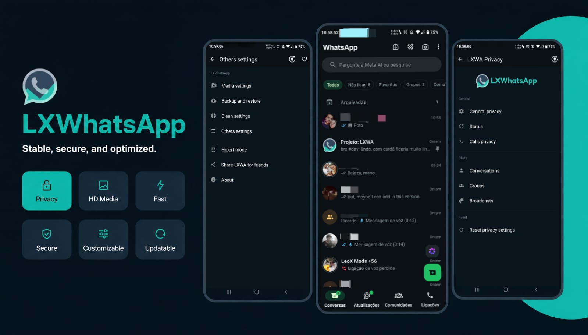

# LXWA

<p align="center">
  
</p>

<p align="center">
  <b>Um mod do WhatsApp focado em desempenho, estabilidade, personalização e privacidade.</b>
</p>

<p align="center">
  
  
  
  
  
</p>

---

# 📖 Sobre

O **LXWA** é um mod baseado no WhatsApp desenvolvido para oferecer uma experiência mais completa sem perder a simplicidade do aplicativo original.

O projeto busca equilibrar:

- 🚀 Desempenho
- 🔒 Privacidade
- 🎨 Personalização
- ⚙️ Compatibilidade
- 🛠️ Estabilidade

Além de recursos exclusivos, o LXWA acompanha constantemente as novas versões do WhatsApp para manter compatibilidade e corrigir problemas rapidamente.

---

# ✨ Recursos

## 🎨 Personalização

- Temas exclusivos
- Alteração das cores da interface
- Ícones personalizados
- Ajustes visuais em conversas
- Personalização da tela inicial
- Modificações da barra superior
- Diversas opções de aparência

---

## 🔒 Privacidade

- Congelar visto por último
- Ocultar status Online
- Ocultar "Digitando..."
- Ocultar "Gravando áudio..."
- Ocultar visualização de status
- Controle avançado das confirmações de leitura
- Configurações individuais por contato/grupo/transmissão

---

## 🚀 Recursos Exclusivos

- Download de Status
- Compartilhamento avançado
- Opções extras para mídia
- Recursos Beta selecionáveis
- Configurações ocultas
- Melhorias exclusivas da interface
- Ferramentas adicionais do LXWA

---

## ⚡ Desempenho

- Otimizações internas
- Melhor gerenciamento de memória
- Redução de processos desnecessários
- Correções específicas para versões recentes
- Melhor estabilidade geral

---

# 📱 Compatibilidade

| Requisito | Suporte |
|-----------|---------|
| Android | 5.0 (API 21) ou superior |
| Root | ❌ Não |
| Instalação Paralela | ✅ Sim |
| Espelhamento | ✅ Recomendado |

---

# 📥 Instalação

1. Baixe a versão mais recente na aba **Releases**.
2. Instale o APK secundário (ou outra variante disponível).
3. Abra o aplicativo.
4. Na tela de inserir o número, toque nos **três pontos**.
5. Selecione **Conectar como dispositivo adicional**.
6. No WhatsApp oficial, abra:

```
Menu
↓
Dispositivos Conectados
↓
Conectar um dispositivo
```

7. Escaneie o QR Code exibido pelo LXWA.

> **Observação**
>
> O espelhamento pode reduzir alguns riscos associados ao uso de aplicativos modificados, porém não elimina completamente a possibilidade de restrições, pois isso depende das políticas do WhatsApp.

---

# 📢 Atualizações

Todas as novidades são disponibilizadas através de:

- Releases do GitHub
- Atualizador interno do LXWA
- Canal oficial do Telegram
- Canal do YouTube

---

# 🐞 Reportar Bugs

Encontrou algum problema?

Antes de enviar um relatório, procure informar:

```
Versão do LXWA:

Versão do Android:

Modelo do aparelho:

Como reproduzir:

Prints (opcional):

Vídeo (opcional):
```

Quanto mais detalhes forem enviados, mais rápida será a correção.

---

# 🛠️ Desenvolvimento

O projeto é atualizado constantemente para acompanhar as novas versões do WhatsApp.

Áreas de desenvolvimento:

- Engenharia Reversa
- Desenvolvimento em Smali
- Java
- XML
- Correções de Compatibilidade
- Otimizações
- Melhorias Visuais

---

# 📸 Capturas de Tela

> Em breve.

---

# ❓ FAQ

### Precisa de Root?

Não.

### Posso instalar junto com o WhatsApp oficial?

Sim, utilizando a variante secundária.

### Existe risco de banimento?

O uso de modificações não oficiais sempre pode estar sujeito às políticas do WhatsApp. Utilize por sua conta e risco.

### O projeto recebe atualizações?

Sim. O LXWA acompanha constantemente novas versões do WhatsApp.

---

# 🤝 Comunidade

## Telegram

https://t.me/LXWAUpdates

## YouTube

https://youtube.com/@leoXzinnn

---

# ❤️ Créditos

Agradecimentos especiais aos testadores que ajudam diariamente no desenvolvimento do projeto.

## Testadores

- Ln Nunes
- Lucas F. Leão
- Kennya
- Samael Dev
- intox #dev

---

# ⭐ Apoie o Projeto

Caso goste do LXWA, considere:

- ⭐ Favoritar o repositório
- 📢 Compartilhar o projeto
- 🐞 Enviar relatórios de bugs
- 💬 Participar da comunidade

Todo apoio ajuda no desenvolvimento.

---

<p align="center">

Desenvolvido com ❤️ por <b>LeoX Mods</b>

</p>
